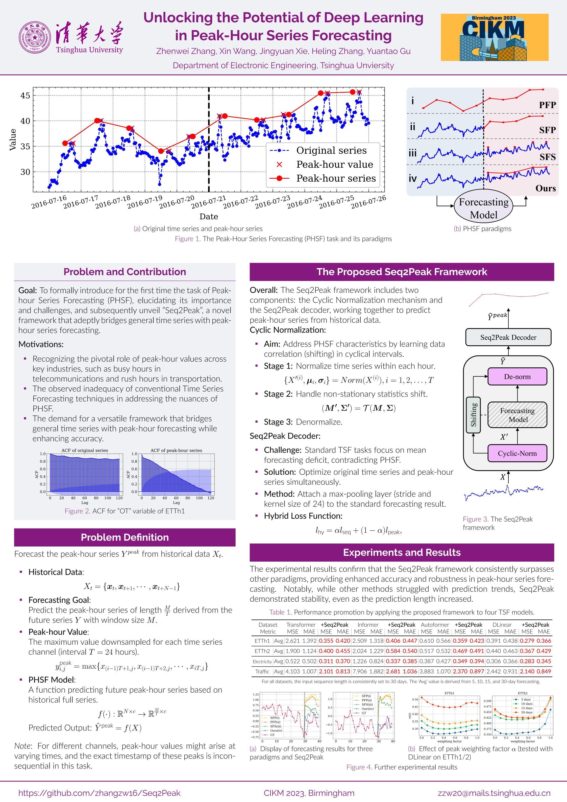

# Unlocking the Potential of Deep Learning in Peak-Hour Series Forecasting. (CIKM 2023)

This repo is the official Pytorch implementation of Seq2Peak: "[Unlocking the Potential of Deep Learning in Peak-Hour Series Forecasting.](https://arxiv.org/abs/2307.01597)". 

We are still updating the README for this repo. Please bear with us. It will be completed soon.

## Citing

If you find this repository useful for your work, please consider citing it as follows:

```bibtex
TODO
```

Please remember to cite all the datasets and compared methods if you use them in your experiments.

-----


